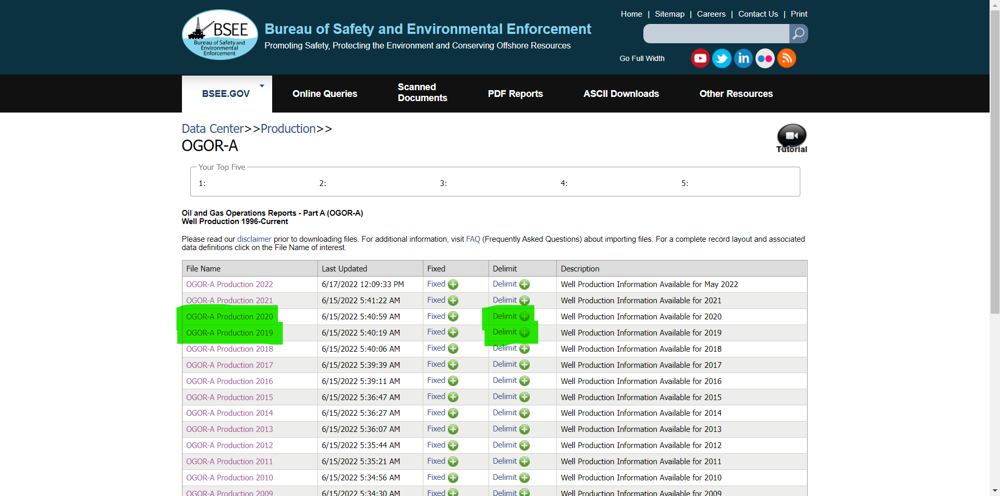
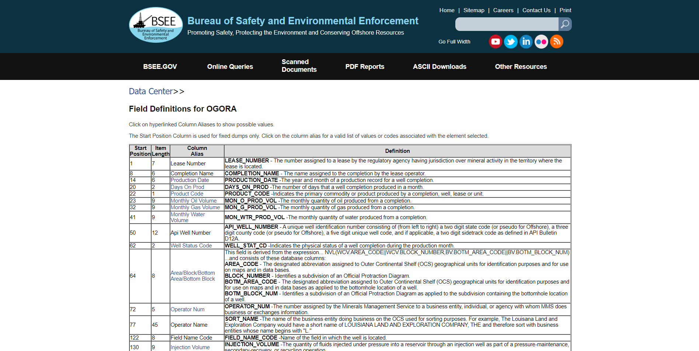
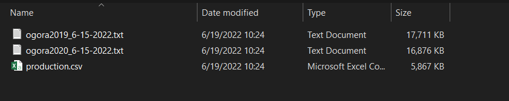

# Web Scraping using BeautifulSoup
The objective of this project is to download specific oil and gas data of the Gulf of Mexico region, clean and combine the data in .csv form. 

The Python script navigates to the 'Bureau of Safety and Environmental Enforcement' website, checks for the latest file updates and downloads only the specified files. Upon generating the files (suppose for years 2019 and 2020), the script cleans the files and generates a combined file (.csv) which contains data from the years 2019 and 2020.

The first step is to navigate to the website (https://www.data.bsee.gov/Main/OGOR-A.aspx). We are interested in the 'Delimit' data for the years 2019 and 2020 as highlighted below: 
 

 
Clicking on “OGOR-A Production 2020” will show the field definitions (or in other words the column names). 
 

The files for a particular year are downloaded as a .zip file. The script downloads the .zip file in the 'Downloads' folder of your PC and then extracts the .zip in a sub folder (Download) of the directory where the .py script is located. If this 'Download' folder does not exist, the script creates the same.

Next, the extracted file (comma separated .csv) is renamed to contain the 'Last Updated' information. This information is also scraped from the website. This is to check later if any new updates have been added to the website for that particular year. 

The .csv file is then converted into a temporary dataframe and this dataframe is concatenated to a different dataframe (df) that contains the extracted data from all the required years. 

Once the dataframe (df) has data from all the required years, the Null values are dropped. No additional cleaning is done.

Finally, the dataframe (df) is then converteed back to a .csv file named as 'production.csv'. The sub folder (Download) now contains the production.csv and the raw comma separated .txt files for all the required years. 
 

The second part of the script checks for any updates in the file for the required years. If there is one, the script just downloads the file for the year(s) for which the data has been updated. This is then followed by the process of creating a temporary dataframe for all the comma separated .csv files from all the years, concatenating to the dataframe (df) and then finally converting the dataframe (df) to a .csv file named as 'production.csv'. The update process ends here and so does the script.
